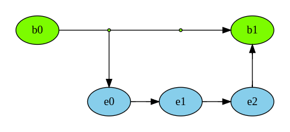
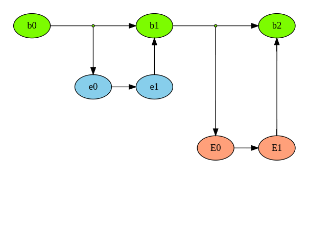
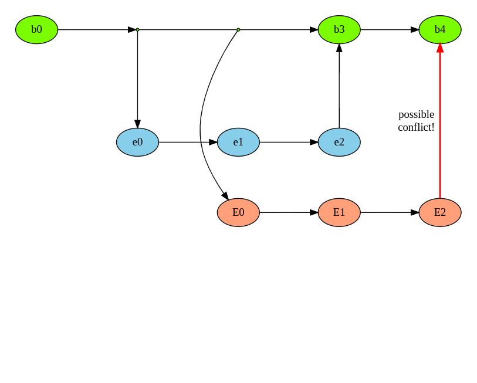
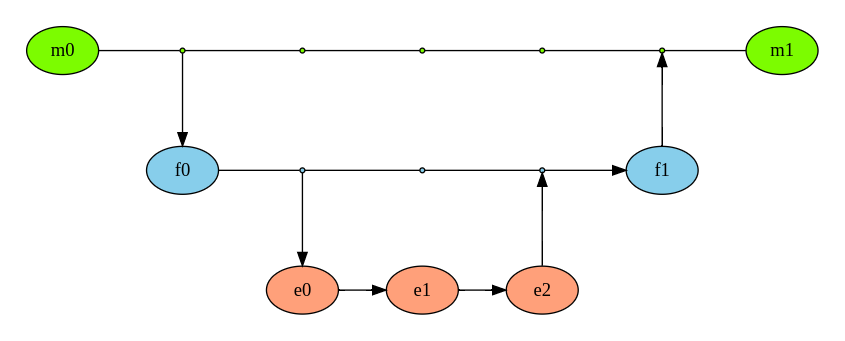

# TTP Full Stack Bootcamp
## Session 1: Class norms and git

---

# Note

This slide deck will serve effectively as our syllabus. Refer back to it as needed!

---

# Goal for this bootcamp

To collaboratively build a webapp (capstone project) that implements the following technologies:

1. ReactJS
2. Responsive Design
3. Third Party Frameworks
4. External APIs
5. User Input
6. Database Administration
7. Server side scripting

---

# Example projects

A stock tracker website that allows users to play-buy stocks and track their net value over time.

{.column}

A restaurant discovery website that allows users to enter their location and food preferences / restrictions and receive a list of restaurants that meet those criteria.

---

# Class Norms
## What are the promises we make to each other as members of this bootcamp?

---

# General Schedule

To respect everyone's time, we will always sharply begin at 10:00am, break for lunch no later than 12:00pm, and end no later than 4:00pm. Lunch will always be at least 1 hour long.

Generally, mornings will be lecture oriented and afternoons will be hands-on workshop oriented. Subject to change.

Attendance will be taken at various points throughout the day. Webcam usage will be observed.

---

# Open and Honest Communication, Always

The classroom works best when everyone feels comfortable to communicate honestly at all times.

Keeping your webcams helps foster an environment where this is possible. It is also magnificent practice for non verbal communication you'll need for interviews.

At the end, the teaching staff will offer LinkedIn endorsements for students who have demonstrated excellent skills, such as with communication.

---

# Engaged Communication

**What it may look like:**

Answering a question  
Asking a relevant question  
Bringing up relevant idea  
Give non verbal feedback  
Respond in Slack or Google Classroom
"Can you go slower?"
"Can you give a different example?"
"Can you go faster?"

{.column}

**How it may happen:**

Speak up during class  
Message during class (to everyone or teaching staff)  
Slack  
Email  
Anonymous Feedback Form
[https://airtable.com/shrz8k2HQ06hnuJcu](https://airtable.com/shrz8k2HQ06hnuJcu)

---

# Assignments

Every day will have a relevant assignment that you'll work on collaboratively, including assistance from the teaching staff as needed.

Assignments will be submitted as github links via a form: [https://airtable.com/shrdhk3TgUWZ6pFO5](https://airtable.com/shrdhk3TgUWZ6pFO5), due by midnight the following day. If you don't complete it by 4:00pm, spend 1-2 more hours to try to get it to work. If you complete it before 4:00pm, take 1-2 more hours polishing / expanding the project or (as applicable) working on your capstone project.

All parts of the github repo are fair game for use for grading, such as the commit history. Except for extenuating circumstances, each member of the group will receive the same grade.

---

# 4 Point Grading scale

**0** Nothing was submitted. Equivalent to an F.  
**1** Code was submitted but it catastrophically fails. Looking at the source code is not convincing that you are on the right track. Equivalent to an F.  
**2** Code mostly works with a reasonable number of bugs or unfinished parts. Or code does not run but source code is convincing that you know what you're doing. Equivalent to a C or B.  
**3** Code meets all expectations, with few or no bugs. Equivalent to an A.  
**4** Code exceeds what is reasonably expected. Equivalent to an A+.

---

# Notes on Grading

**2s are perfectly fine!** If all you receive are 2s for the entire bootcamp, you are doing amazing work!

The teaching staff will aim to return grades + feedback within 24 hours.

---

# Examples for each grade value

Assignment: create a blackjack game in Javascript

**0** No code submitted  
**1** Code submitted but does not run and does not have clear identifiable parts, like a stack of cards, way to deal them out, or a way to determine winning and losing.  
**2** Code runs but misses / mishandles 1 or 2 pieces, such as properly reshuffling the deck or intelligently handling aces as 1 or 11.  
**3** Code is a full on blackjack game with no visible bugs.  
**4** Code handles advanced logic like calculating odds to win or simulating multiple players.

---

# Thumb Poll

For each of the following statements, give a thumbs up if you agree or a thumbs down if you disagree:

1. Javascript is better than C++
2. Game of Thrones is overrated
3. The correct way to make a bowl of cereal is milk first
4. Your assignments in this class are graded on a 5 point scale
5. AI is the best branch of CS

---

# Pause for Questions

---

# Reversal!
## Each student come up with one question for anyone on the teaching staff. Ask it via video or chat.

Some examples of questions:
- *What's it like founding your own social good tech startup?*
- *What's your favorite project that you've ever worked on?*
- *Where did you grow up?*
- *Who is your favorite Avenger?*

---

# git

---

# What is it?

**a version control system**

git creates an exhaustive edit history for each file in your project, allowing you to retain different versions, revert to older versions, and much more.

**a code collaboration system**

git creates local copies of the project on your machine and intelligently sends your changes to a master repository or storehouse of code. you can also automagically receive code changes from other teammates in a (usually) frictionless way.

---

# Why should I learn it?

- Ubiquitous in the world, from startup to enterprise level
- Github often acts as your portfolio
- Easiest way to collaborate on large projects
- Can rollback and track changes

---

# git Overview: Standard Case



---

# git Overview: Standard Case Code

```
git pull
*make edits to files*
git status
git add -A
git commit -m "explanation of changes"
*might need to git pull*
git push
```
---

# git Overview: Collaborators Case



---

# git Overview: Conflict Case



---

# git Overview: Conflict Case Code


```
git pull
*make edits to files*
git status
git add -A
git commit -m "explanation of changes"
git pull
git merge
git push
```

---

# git Overview: Branch Case



---

# git Overview: Branch Case Code

```
git checkout master
git checkout -b new_feature
*make extensive edits; for each edit:*
git status
git add -A
git commit -m "explanation of changes"
git push
*generate pull request*
git checkout master
```

---

# rare git commands

- `git config --global [key] [value]`  
if you're running git for the first time on the current machine
- `git init`  
if you're starting a brand new directory as a git project
- `git clone [url]`  
if you're creating a copy of a remote git repo for the first time

---

# common git commands 1/2

- `git status`  
shows you changes needed to be saved, pushed, pulled, etc
- `git add [file or option]`  
stages a file or directory for pushing to central location
- `git diff [file]`  
shows changes that have been made locally
- `git commit -m '[descriptive message]'`  
attaches a message to changes you've staged
- `git push`  
sends your committed changes to the central repo

---

# common git commands 2/2

- `git pull`  
attempt to automagically retrieve and apply changes from the central repo to your machine
- `git merge`  
reconcile changes between your local repo and the central repo
- `git branch -b [branch name]`  
create a separate copy of the central repo for significant, extended changes
- `git checkout [branch name]`  
switch to a different branch / version
- `git checkout [file]`  
trash your local changes and replace it with what's on the central repo

---

# more on git

git is an exhaustive, mature, well supported system. There are many more features and workflows that we won't cover.

A special file called .gitignore is key when working with large projects. 3rd party libraries, caches, sensitive credential files, etc should not be committed to repos and can be excluded with a proper .gitignore file.

---

# commit messages and pushing

commit messages are brief descriptions of changes you've made to the central code. be **descriptive** and **to the point**.

what helps is to **push often** so your descriptions are naturally short. it is not uncommon to push a change that is only 10 lines of code. also keep commits limited in scope.

**only push working code**. there are some exceptions to this (eg if you're working on your own branch) but those are few and far between

---

# Other git resources

Official git cheatsheet:  
[https://education.github.com/git-cheat-sheet-education.pdf](https://education.github.com/git-cheat-sheet-education.pdf)

Code Academy lessons:  
[https://www.codecademy.com/learn/learn-git](https://www.codecademy.com/learn/learn-git)

---

# Pause for Questions
## & quick Thumb Poll check-in

---

# git in action!

We'll use today's assignment as a quick demo of how to run the more common git commands

[https://github.com/jonathan-chin/mec-ttp-2021-winter-assignment-1](https://github.com/jonathan-chin/mec-ttp-2021-winter-assignment-1)
