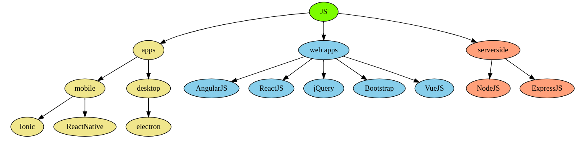

# TTP Full Stack Bootcamp
## Session 2: git continued, outlining projects, javascript part 1

---

# Outline for today

**10:00am - 11:00am** Review advanced usages of git  
**11:00am - 12:00pm** In-class work time to finish up assignment 1 (hope to submit before lunch)  
**12:00pm - 1:00pm** Lunch  
**1:00pm - 2:30pm** JS lesson including live coding example  
**2:30pm - 4:00pm** In-class work time for assignment 2

---

# Review

- What is the purpose of our bootcamp?
- What are some technologies we will be using?
- What is git?
- What is a common pattern of git commands that you will run often?

---

# git Continued - feature branch

Feature branches are generally used when you want to make extensive edits / additions / deletions to the master code.

Feature branches should be **limited in scope** to reduce errors, increase ease to find bugs, and keep your team consistently up to date. Some examples of feature branches

- upload_videos
- user_defined_themes
- phone_number_validation

---

# git branch workflow

```
git checkout master
git checkout -b phone_number_verification
// make edits
// for each edit:
  git add -A
  git commit -m "explanation of changes"
  git push

// when feature is complete
git checkout master
// create pull request on Github
```

---

# git branch tips

`git branch` is your friend. It acts much like `git status`.

You might need to use the `--set-upstream` flag with `git push` for new branches. More generally, pay attention to error and status messages!

There is an alternative way to merge branches from the terminal. However, pull requests via Github are an industry standard and also offer other great features.

---

# Live Demo of using feature branches

---

# Thumb Poll
## did any experience a merge conflict?

<!--
quick workshop from Juan
-->

---

# Choose Your Own Adventure Continued

- Use the rest of this morning to work in teams.
- Sorry for shuffling the requirements around. The original **3** commits, **2** issues, and **1** branch requirements are back.
- Goal is to submit project before we break for lunch.
- Advanced case: figure out how to implement anchor links so we can click on options instead of having to scroll to them! Example:  
[https://github.com/ekalinin/github-markdown-toc](https://github.com/ekalinin/github-markdown-toc )

---

# Javascript (JS)

---

# What is it?

A programming language bound to webpages to add instant, rich interactivity.

Prior to 1995, the Internet was a series of static pages, much like an old school newspaper. Javascript was invented to begin its transformation into what we know today.

---

# Why is it important?



---

# JS Basic Data Types

- **booleans**  
eg: *true, false*
- **numbers**  
eg: *42, 3.14* JS does not distinguish between ints and floats
- **strings** 
eg: *"hello", 'world', \`and Mars\`*. backticks \` allow strings to embed JS expressions and make working with strings much easier.
- **null**  
explicitly no value.
- **undefined** 
explicitly unknown value.

---

# JS Advanced Data Types
- **arrays**  
eg: *[14, 42, 49, 86], ['hello', 'world'], ['The', 7, 'Samura']* collection of other data types. does not have to be homogenous. can nest other arrays.
- **objects**  
eg: *{last_name: 'Bond', full_name: 'James Bond'}* key-value pairs, where keys are variable-like names and values can be any data type.

<!--
null is equivalent to None in python
undefined has no real equivalent in python
-->

---

# JS is weakly (dynamically) typed

JS makes a best attempt guess at what you **probably** mean. Quick poll: what do you think the result is for the following statements?

1. `1 + 2`
2. `'1' + 2`
3. `1 + '2'`
4. `'1' + '2'`
5. `1 - 2`
6. `'1' - '2'`
7. `1 - '2'`

---

# Declaring variables

There are 3 ways to declare variables: `var`, `let`, `const`

- `var` declares a variable that is available globally or anywhere within its function
- `let` declares a variable that is only available within its scope
- `const` operates exactly like `let` except that its value cannot change

---

# Examples of variable declaration

What do you think happens in the following code block?

```
var chance = Math.random();

if(chance < 0.5){
    var status = 'heads';
}else{
    var status = 'tails';
}

console.log(status);
```
---

# Examples of variable declaration

What do you think happens in the following code block?

```
var chance = Math.random();

if(chance < 0.5){
    let status = 'heads';
}else{
    let status = 'tails';
}

console.log(status);
```

---

# Examples of variable declaration

What do you think happens in the following code block?

```
var chance = Math.random();

if(chance < 0.5){
    const status = 'heads';
}else{
    const status = 'tails';
}

console.log(status);
```

---

# Self imposed restrictions

Since `let` and `const` are more restrictive in an (arguably) too loose language like JS, try to use them **as much as possible** to keep yourself actively thinking about how you code.

Typescript (TS) was developed as a superset of JS that adds optional static typing, making it behave more like C++ and Java. TS is fairly popular.

---

# JS Debugging Tools

`console.log()` is your all-purpose way to output data. It is analogous to Python's `print()`

`alert()` is a more obnoxious version of `console.log()` and is only available when a browser window is available. ie: it is not available in NodeJS

There are others but these 2 are my primary ones.

---

# JS Functions

Functions can be declared in 3 major ways:

```
function square(value){return Math.pow(value, 2);}
const square = function(value){return Math.pow(value, 2);};
const square = (value) => {return Math.pow(value, 2)};
```

There are subtle differences that we will dive deeper into later. For now, any of these ways are valid.

---

# JS Resources

W3 Schools [https://www.w3schools.com/js/default.asp](https://www.w3schools.com/js/default.asp)

Mozilla Developer Network [https://developer.mozilla.org/en-US/docs/Web/JavaScript](https://developer.mozilla.org/en-US/docs/Web/JavaScript)

---

# Pause for Questions
## & for a small break!

---

# Let's do a live coding demo!

---

# First, Project Outlining

Before diving into a coding session, it is always good practice to do some outlining. Much like an English essay, outlining helps you stay focused, identify potential pitfalls, and communicate your ideas to others in a quick, natural way.

It's highly useful in coding interviews and stand up meetings. Here are some key parts to a project outline.

---

# Define the purpose

Briefly describe what your project is doing. This helps put everything else into context.

---

# Outline major features

Sometimes called `user stories`, these are brief, high level descriptions of what is possible to achieve with this code. For example:

```
/*
- User should be able to find themselves on a map.
- User should be able to reposition themselves if the automatic coordinates are wrong.
- User should be able to request a car from that position.
- Drivers should get alerts when users nearby request a car.
*/
```

---

# Use function stubs

This takes the features and breaks them down more granularly. Often, there are several moving parts to a single feature, so laying out their general skeleton (or stub) helps refine your focus. It also helps with divide and conquer if there are multiple developers on your team. For example:

```
get_gps_coordinates(){
  return {lat: 0, lng: 100};
}
load_map(api_key){}
scroll_map(coordinates){}
```

---

# Identify gotchas!

Using your insight and experience, can you identify potential road blocks down the road? It's often best to spend a few minutes to try and write these down; it will save you heartache and time down the road. For example:

```
// if user is on vpn, gps coordinates will be way off!
```

---

# Reduce the problem space

Where possible, try to use assumptions to reduce the problem space. Get your code to a minimally viable state and then slowly roll back those assumptions to achieve your final state. For example:

```
// for now, assume user always has GPS signal
// for now, assume there is always at least 1 driver nearby
```

---

# Live Coding Demo, for real

This will be a variation of your assignment for today:
[https://github.com/jonathan-chin/mec-ttp-2021-winter-assignment-2](https://github.com/jonathan-chin/mec-ttp-2021-winter-assignment-2)